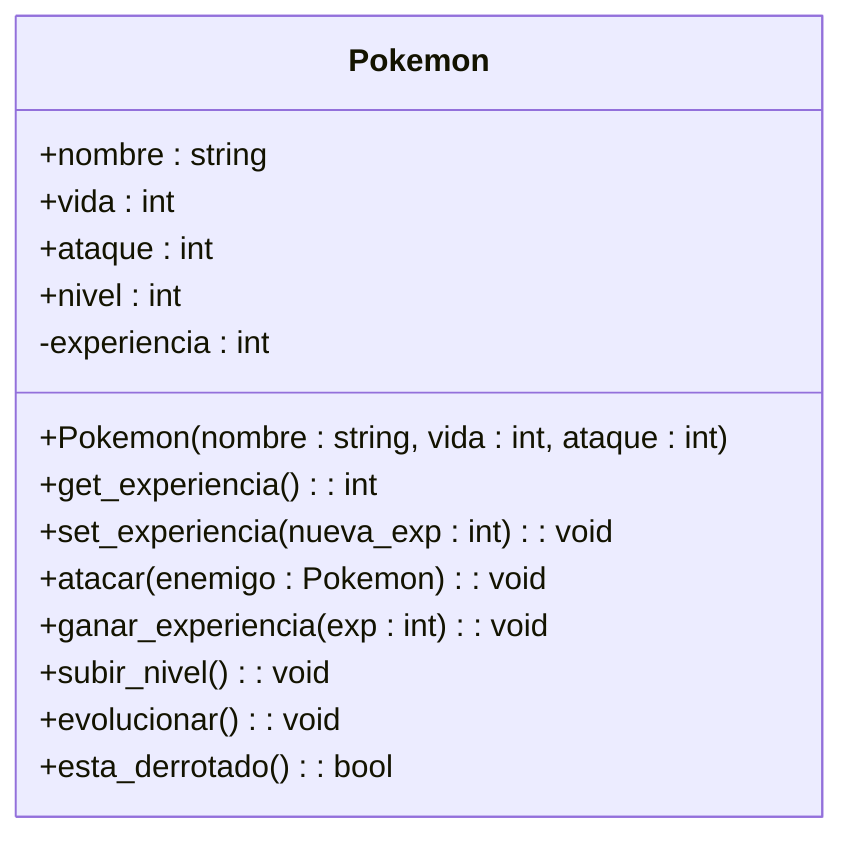

```mermaid
classDiagram
class Pokemon {
  +nombre : string
  +vida : int
  +ataque : int
  +nivel : int
  -experiencia : int

  +Pokemon(nombre : string, vida : int, ataque : int)
  +get_experiencia() : int
  +set_experiencia(nueva_exp : int) : void
  +atacar(enemigo : Pokemon) : void
  +ganar_experiencia(exp : int) : void
  +subir_nivel() : void
  +evolucionar() : void
  +esta_derrotado() : bool
}
```

que entendió sobre las relaciones? 
¿su clase de ejemplo que creo tiene relaciones con otras clases? ¿por qué? fundamente (min 5 líneas máx. 30).
