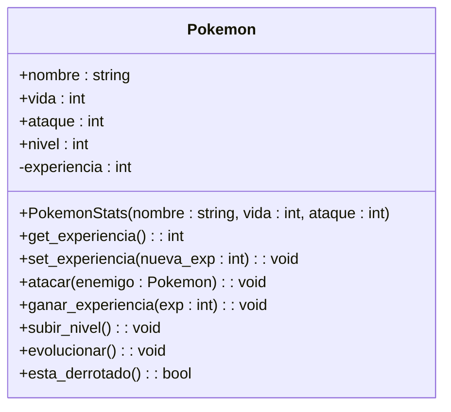

-----------------------------------
## **¿Qué entendió sobre las relaciones?**
Existen distintos tipos de relaciones:

**1. Herencia:** Sirve para distinguir cada clase con sus respectivas características o también para enlazar una subclase a la clase principal lo cual sería la relación de herencia. Es decir que las subclases heredan todos los métodos y atributos de la superclase.

**2. Abstracción:** Se pone en cursiva cuando podría ser una clase abstracta.

**3. Asociación:** 

¿su clase de ejemplo que creo tiene relaciones con otras clases? ¿por qué? fundamente (min 5 líneas máx. 30).
