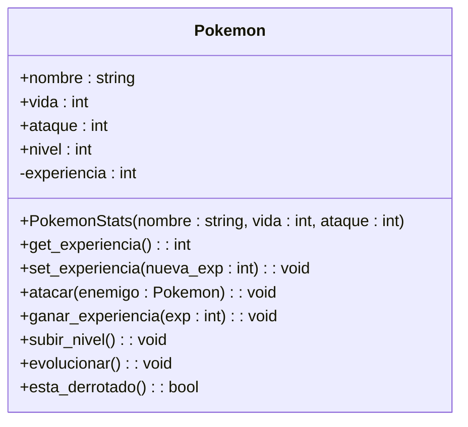

-----------------------------------
## **¿Qué entendió sobre las relaciones?**
Existen distintos tipos de relaciones:

**1. Herencia:** Sirve para distinguir cada clase con sus respectivas características o también para enlazar una subclase a la clase principal lo cual sería la relación de herencia. Es decir que las subclases heredan todos los métodos y atributos de la superclase.

**2. Abstracción:** Se pone en cursiva cuando podría ser una clase abstracta.

**3. Asociación:** Es una asociación básica sin que dependa de donde proviene.

**4. Agregación:** Es un tipo de asociación donde se especifica un todo y sus partes. Se podría hacer una subclase enlazada a otra subclase lo que nos permite agregar una relación.

**5. Composición:** Esta no puede existir fuera del todo, por lo que esta subclase no puede existir separada de la clase principal de la que deriva.

**6. Multiplicidad:** Permite definir recepciones numéricas en las relaciones lo que nos permite definir cantidades según corresponda el caso.

----------------------------

## **¿Su clase de ejemplo que creó tiene relaciones con otras clases? ¿por qué?**

Mi class Pokemon sí tiene relaciones, por ejemplo en:

```python
def atacar(self, enemigo):
```
Esto hace que el pokemon "self" ataque al otro pokemon "enemigo" lo cual sería un ejemplo de **asociación** ya que un objeto interactúa con otro.

También en mi código existe una relación de **encapsulamiento**:

```python
self.__experiencia
```
Lo cual significa que la experiencia es privada, es decir, el objeto está protegido. Y se puede acceder a ellas de la siguiente forma:

```python
get_experiencia()
set_experiencia()
```
Por lo tanto, estas relaciones nos sirven para acceder o proteger atributos además de coordinar su acceso a través de los métodos. Gracias a esto se puede mantener una estructura en el código para su buen funcionamiento.
