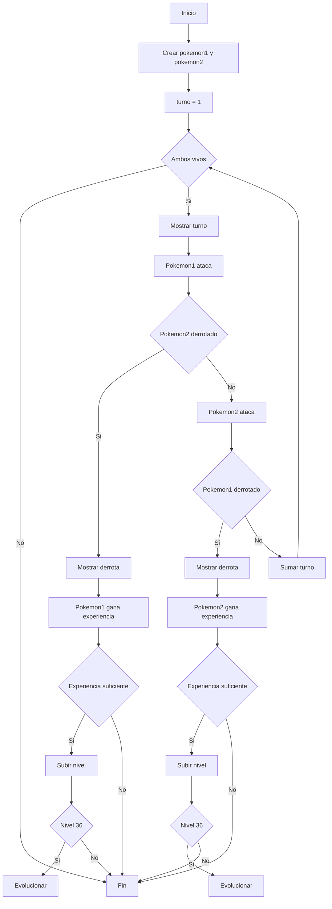

## Diagrama de flujo para proyecto Pokemon en python.

```mermaid
flowchart TD

A[Inicio] --> B[Crear pokemon1 y pokemon2]
B --> C[turno = 1]

C --> D{Ambos vivos}

D -- No --> Z[Fin]
D -- Si --> E[Mostrar turno]

E --> F[Pokemon1 ataca]
F --> G{Pokemon2 derrotado}

G -- Si --> H[Mostrar derrota]
H --> I[Pokemon1 gana experiencia]
I --> I1{Experiencia suficiente}

I1 -- Si --> I2[Subir nivel]
I2 --> I3{Nivel 36}
I3 -- Si --> I4[Evolucionar]
I3 -- No --> Z

I1 -- No --> Z

G -- No --> J[Pokemon2 ataca]

J --> K{Pokemon1 derrotado}

K -- Si --> L[Mostrar derrota]
L --> M[Pokemon2 gana experiencia]
M --> M1{Experiencia suficiente}

M1 -- Si --> M2[Subir nivel]
M2 --> M3{Nivel 36}
M3 -- Si --> M4[Evolucionar]
M3 -- No --> Z

M1 -- No --> Z

K -- No --> N[Sumar turno]
N --> D
```

## Prompt Utilizado para la generación del ejemplo de flujo"

[prompt](prompt_flowchart.md)

